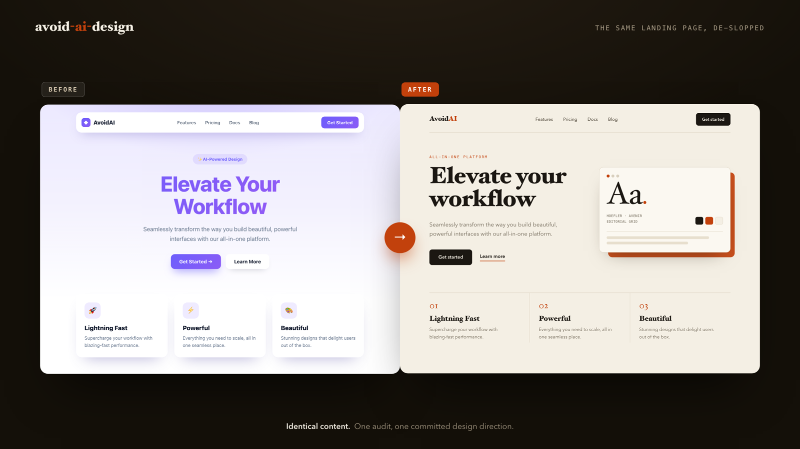

<!-- SEO: title + meta description live in docs/SEO.md -->

# avoid-ai-design

**A Claude Code skill that audits AI-generated frontend code and rewrites it so it stops looking AI-generated.**

[](LICENSE)
[](https://agentskills.io)
[](https://claude.com/claude-code)
[](#compatibility)

<p align="center">
  
</p>

<p align="center"><sub><i>Left: what every model ships. Right: the same content after <code>avoid-ai-design</code>. Both pages are real and live in <a href="examples/">examples/</a>.</i></sub></p>

Ask Claude, Codex, or any model to "build a landing page" and you get the same page every time: a purple-to-blue gradient on white, Inter for every word, a centered hero with three rounded feature cards, and a glassy navbar. `avoid-ai-design` is the cleanup pass. It reads the frontend an AI just produced, flags the patterns that give it away, and rewrites the interface around one committed design direction.

It is the design counterpart to [`avoid-ai-writing`](https://github.com/Significant-Gravitas/avoid-ai-writing): same idea, applied to UI instead of prose.

---

## The problem: AI design converges

Large language models are trained toward the average, so their UI output clusters around a handful of safe defaults. The result is recognizable on sight, the visual equivalent of "delve" and "in today's fast-paced world":

- **Type** that is always Inter, Roboto, or the system stack, with no pairing and no display face.
- **Color** that is a purple or indigo gradient fading into blue, on a white or near-black background.
- **Layout** that centers everything: hero, subhead, two buttons, then a three-card feature grid.
- **Components** wrapped in `rounded-2xl`, `shadow-lg`, and `backdrop-blur`, lifted straight from the shadcn defaults with the zinc palette untouched.
- **Copy** that opens with "Elevate your workflow" and ends with a "Get Started" button.

None of these are wrong on their own. Together, on every page, they read as machine-made. This skill names each tell and gives you a concrete way out.

## What it catches

The full catalog lives in [`references/ai-tells-catalog.md`](references/ai-tells-catalog.md). Each entry pairs a detection signal with a fix for plain HTML/CSS and a fix for React + Tailwind + shadcn.

| Category | Example tells |
|---|---|
| **Typography** | Inter / Roboto / system default, no display face, the overused "safe" pick (Space Grotesk) treated as a non-choice |
| **Color** | purple→blue gradient on white, untouched shadcn `zinc`/`slate`, timid evenly-spread palettes, default Tailwind `blue-600` buttons |
| **Layout** | centered hero, the hero + three-feature-cards + CTA template, uniform section rhythm, zero asymmetry |
| **Components** | `rounded-2xl shadow-lg` on everything, glassmorphism by reflex, icon-in-a-rounded-square, default Card/Button with no styling |
| **Spacing** | uniform `gap-4` / `p-6` with no spatial hierarchy |
| **Motion** | none at all, or the same `fade-in-up` on every element |
| **Icons** | unedited `lucide` set, emoji used as feature bullets |
| **Copy** | "Elevate / Seamless / Powerful", generic CTAs, filler microcopy |
| **Imagery** | gradient placeholders, DiceBear avatars, generic stock-photo energy |

## Two modes

| Mode | What it does | When to use |
|---|---|---|
| `rewrite` *(default)* | Audit, propose a direction, then rewrite the code | You want the UI fixed |
| `detect` | Audit and score only, no edits | You want to see the tells and decide yourself, or you are reviewing code you should not change |

Trigger `detect` with phrases like "just audit", "flag only", "don't change the code", or "scan this for AI tells".

## How it works

1. **Scope.** Identify what you are auditing (a component, a page, a whole app), the stack, and the mode.
2. **Audit.** Walk the catalog against your code and report each tell with its location, category, severity, and *why it reads as AI*.
3. **Direction.** Commit to one concrete aesthetic direction for the artifact (for example brutalist editorial, warm editorial pastel, or refined luxury), named with three to five defining moves. You confirm it before any code changes.
4. **Calibrate.** A small component or anything inside an existing design system gets a surgical pass that preserves structure. A standalone page or marketing artifact gets a bold rebuild around the chosen direction.
5. **Rewrite.** Edit the real files. Functionality, props, data flow, accessibility, and the meaning of your copy stay intact. New dependencies are called out, never added silently.
6. **Re-audit.** Run the catalog again over the result and report what survived. The target is zero P0 tells.

### Severity tiers

- **P0** screams AI on sight: the purple→blue gradient, Inter everywhere, the centered hero-plus-three-cards template, untouched shadcn zinc, reflexive glassmorphism.
- **P1** is the obvious AI smell: `rounded-2xl shadow-lg` on every surface, icon-in-rounded-square, emoji feature bullets, default blue buttons, "Elevate your…" copy.
- **P2** is cosmetic: flat uniform spacing, missing or copy-paste motion.

Quick passes fix P0 and P1. A full audit covers all three.

## Install

Clone straight into your Claude Code skills directory:

```bash
git clone https://github.com/funboy322/avoid-ai-design.git ~/.claude/skills/avoid-ai-design
```

Or install it per-project instead of globally:

```bash
git clone https://github.com/funboy322/avoid-ai-design.git .claude/skills/avoid-ai-design
```

Then start (or restart) Claude Code and confirm it loaded:

```
/skills
```

You should see `avoid-ai-design` in the list. No build step, no dependencies.

## Use it

Once installed, just ask in plain language. The skill triggers on intent, not a fixed command:

```
de-slop this landing page
make this component look less AI-generated
audit App.tsx for AI design tells, don't change anything
this dashboard looks generic, give it a real point of view
```

You can also name a direction up front ("rewrite this as brutalist editorial") or let the skill propose one.

## Compatibility

`avoid-ai-design` is a plain [`SKILL.md`](https://agentskills.io) file with two reference documents. It needs no external tools, APIs, or keys, so it runs anywhere the format is supported:

- Claude Code (CLI, desktop, web, IDE extensions)
- Cursor
- OpenAI Codex CLI
- GitHub Copilot (VS Code)
- Any other agent that reads the agentskills.io `SKILL.md` format

## How it differs from `frontend-design`

Anthropic's [`frontend-design`](https://github.com/anthropics/skills/tree/main/skills/frontend-design) skill generates distinctive UI **from scratch**, when you are starting a new component. `avoid-ai-design` works on code that **already exists**: it audits, scores, and rewrites output you (or another model) already produced. Use `frontend-design` to write, `avoid-ai-design` to fix. They share a goal and complement each other.

## FAQ

**What is "AI slop" in web design?**
The cluster of default visual choices that AI tools reach for unprompted: purple-to-blue gradients, Inter, centered heroes with three feature cards, untouched shadcn components, and glassmorphism everywhere. It is generic because the model is averaging across its training data.

**How do I make AI-generated UI look less generic?**
Replace the defaults with intentional choices: a distinctive type pairing, a dominant color with a sharp accent instead of a timid gradient, an asymmetric layout, and motion that serves one or two key moments. This skill does that for you, or flags exactly what to change in `detect` mode.

**Does it work with code from Codex and other models, not just Claude?**
Yes. The tells are model-agnostic because the convergence is. It catches the same patterns regardless of which assistant wrote them.

**Will it break my working code?**
No. The rewrite preserves functionality, props, state, routing, accessibility, and the meaning of your copy. Inside an existing design system it stays surgical and respects your tokens. If the UI is already distinctive, it tells you and stops rather than inventing problems.

**Do I need to install anything else?**
No. It is a single skill folder with no dependencies.

## Repository layout

```
avoid-ai-design/
├── SKILL.md                          # workflow, modes, calibration, severity, output format
├── references/
│   ├── ai-tells-catalog.md           # the catalog, by category, with HTML and React fixes
│   └── aesthetic-directions.md       # bold directions to choose from, and how to commit
├── README.md
├── LICENSE
└── docs/
    └── SEO.md                        # discoverability notes for maintainers
```

## Contributing

Found a tell the catalog misses? Open a pull request that adds it to [`references/ai-tells-catalog.md`](references/ai-tells-catalog.md) in the existing format: the detection signal, why it reads as AI, and a fix for both HTML/CSS and React/Tailwind. Real before-and-after examples are welcome.

## License

[MIT](LICENSE).

---

<sub>**Keywords:** Claude Code skill · remove AI slop · de-slop UI · AI design patterns · generic AI aesthetics · AI-generated website detector · frontend design audit · Tailwind / shadcn / React · Codex · agentskills.io · avoid AI design.</sub>
